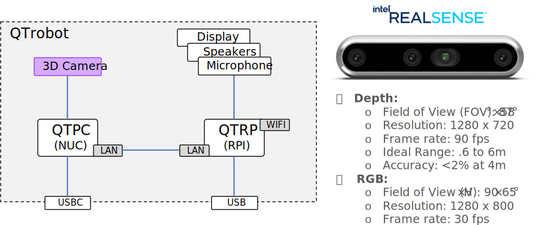
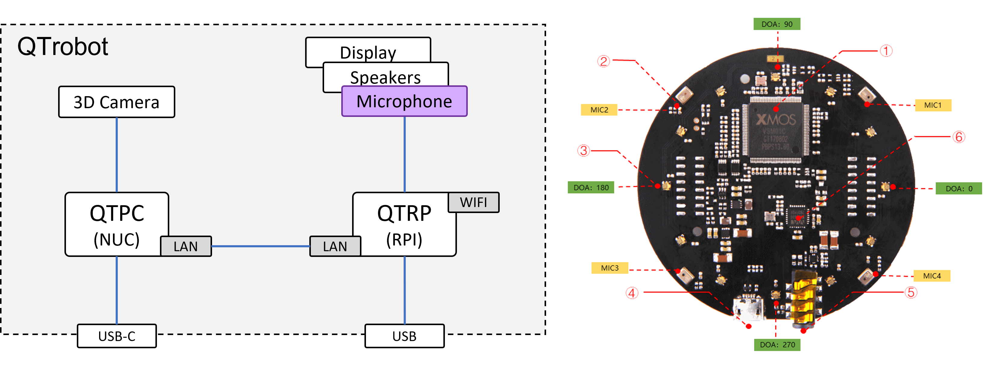
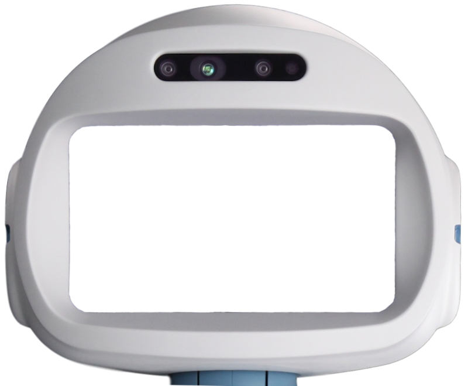
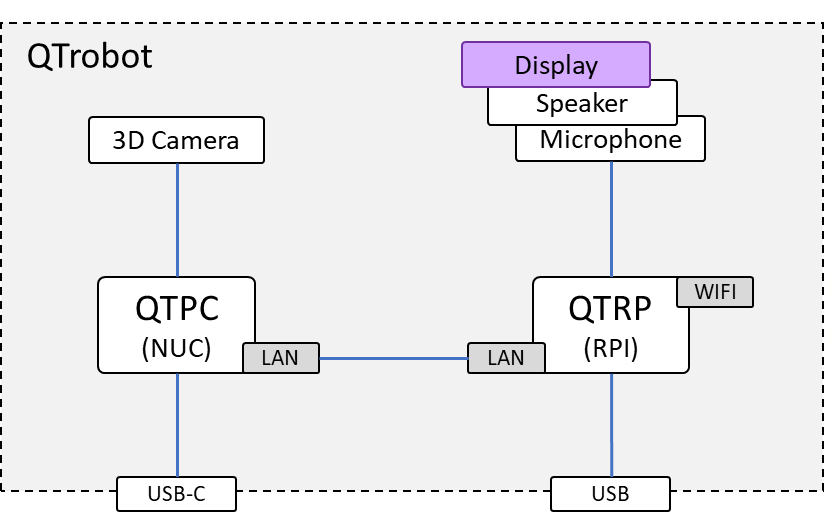
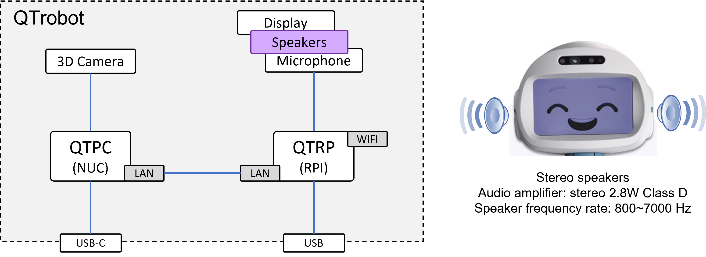
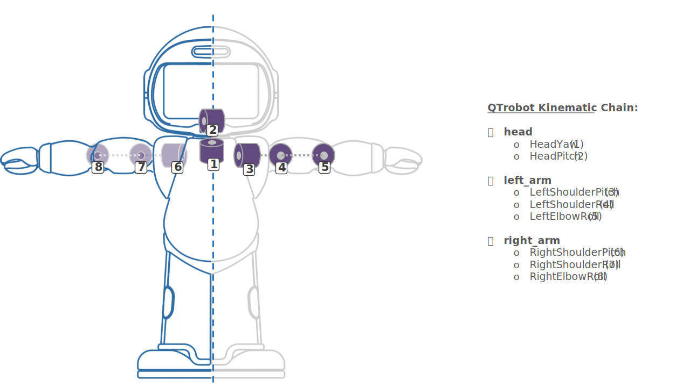

# Aktoren und Sensoren
QTrobot ist eine Forschungsplattform mit leistungsstarken Computern und modernster Hardware wie 3D-Kamera und Fernfeldmikrofon-Array.
Folgende Aktoren und Sensoren sind eingebaut und einsetzbar:

## [Kamera](https://docs.luxai.com/docs/modules/camera)
QTrobot besitzt eine Intel RealSense D435 Kamera, welche für verschiedene Aufgaben verwendet werden kann.
Zum Einen können mit der Kamera Bilder aufgenommen werden, um diese später zu verwenden.
Zum Anderen kann die Kamera auch für Aufgaben wie Gesichts- Emotionserkennung und Objekterkennung verwendet werden.

## [Mikrofon](https://docs.luxai.com/docs/modules/microphone)
Im Kopf befindet sich ein gesamtes Mikrofon-Array, welches für die Aufnahme von Sprache oder die Spracherkennung verwendet werden kann.

## [Display](https://docs.luxai.com/docs/modules/display)
Es findet sich auch ein Display im Kopf des QTrobot. Dieses Display wird primär dazu verwendet, um Gesichtsausdrücke und Emotionen darzustellen.

## [Lautsprecher](https://docs.luxai.com/docs/modules/speakers)
Für die Ausgabe von Sprache oder Audio allgemein befindet sich im Kopf des QTrobot ein Lautsprecher.

## [Ellbogen-, Schulter- und Kopfgelenke](https://docs.luxai.com/docs/modules/motors)
QTrobot ist mit einer Reihe von Motoren ausgestattet, die es ihm ermöglichen, sich zu bewegen.
Insgesamt hat QTrobot 8 Motoren, um die Bewegung der Arme und des Kopfes zu ermöglichen.
Die Motoren können einzeln angesteuert und ausgelesen werden.

# Links
* [Gesicht und Emotion](https://docs.luxai.com/docs/modules/display)
* [Ton und Sprache](https://docs.luxai.com/docs/modules/speakers)
* [Spracherkennung](https://docs.luxai.com/docs/modules/microphone)
* [Vision](https://docs.luxai.com/docs/modules/camera)
* [Bewegung](https://docs.luxai.com/docs/modules/motors)
