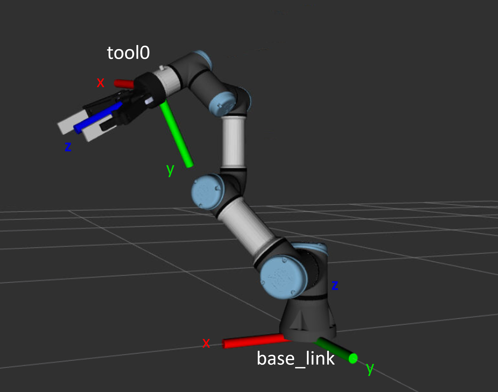

# Knickarm Roboter

Der Universal Robot UR3e ist ein Sechsachs-Knickarm-Roboter, der mit einem 2-Finger Greifer von Robotiq ausgestattet ist. Dank gewissen Sicherheitselementen kann der Roboter als Cobot (kollaborierender Roboter) unter gewissen Umständen ohne zusätzliche Schutzeinrichtungen zusammen mit Menschen im selben Raum eingesetzt werden. Bevor ihr aber mit dem echten Roboter arbeitet, könnt ihr die ersten Aufgaben rein virtuell lösen.

## Aufgabe 1: Bewegt den virtuellen UR3e

Folgt der Anleitung im [Readme](Readme.md) um den Universal Robot in RViz zu visualisieren. Versucht, den Roboter virtuell zu bewegen, in dem ihr den Python Code in `kinematics.py` anpasst.

## Aufgabe 2: Vorwärtskinematik

Verschafft euch durch Lektüre des Wikipedia-Artikels 

[https://de.wikipedia.org/wiki/Denavit-Hartenberg-Transformation](https://de.wikipedia.org/wiki/Denavit-Hartenberg-Transformation)

 einen ersten groben Überblich über die Kinematik eines Industrieroboters. Beginnend vom Basis-Koordinatensystem im Rumpf des Roboters `base_link`, überlegt euch, wie ihr von diesem Koordinatensystem durch Rotationen und Translationen in das Koordinatensystem des Endeffektors (hier: des Flansches, `tool0`) übergeht. Vorzugsweise verwendet ihr hierzu Homogene Matrizen.

Die Denavit-Hartenberg Parameter für den UR3e findet ihr auf der [Website von Universal Robots](https://www.universal-robots.com/articles/ur/application-installation/dh-parameters-for-calculations-of-kinematics-and-dynamics/) in einer Tabelle.

> **Hinweis zu ROS**

> ROS verwendet nicht die Denavit-Hartenberg Konvention für die Beschreibung der Robotergelenke. Als Alternative könnt ihr auch die Geometrie des Roboters aus der Roboterbeschreibung im [Git Repo des Herstellers](https://github.com/ros-industrial/universal_robot/blob/melodic-devel/ur_description) herauslesen. ROS verwendet dazu das Unified Robot Description Format (URDF). Wie das genau aufgebaut und definiert ist, findet ihr [hier](http://wiki.ros.org/urdf/XML). Die geometrischen Informationen, welche ihr für die Lösung der Aufgabe benötigt, befinden sich in der Beschreibung der `Links` und der `Joints`.
Die Beschreibung des UR3e wird in mehreren Schritten über das [urdf/ur3e.xacro](https://github.com/ros-industrial/universal_robot/blob/melodic-devel/ur_description/urdf/inc/ur3e_macro.xacro) File erstellt. Die Definition der `Links` und der `Joints` befinden sich in der Datei [urdf/ur_macro.xacro](https://github.com/ros-industrial/universal_robot/blob/melodic-devel/ur_description/urdf/inc/ur_macro.xacro). Dabei werden die Parameter wie z.B. `${shoulder_x}` aus der Datei [ur3e/default_kinematics.yaml](https://github.com/ros-industrial/universal_robot/blob/melodic-devel/ur_description/config/ur3e/default_kinematics.yaml) ausgelesen.

Wenn ihr eine Pose bzw. ein Koordinatensystem in RViz anzeigen möchtet, könnt ihr die `PoseStamped` Message verwenden. Der Code dazu ist schon für euch im `kinematics.py` vorbereitet. Da die `PoseStamped` Message keine homogenen Matrizen verwendet, sondern Quaternionen, habe ich ebenfalls die Funktion `get_pose_message_from_matrix(matrix)` erstellt, welche eine `PoseStamped` Message für eine homogene Matrize erstellt. Evtl. müsst ihr einige Codezeilen in der `run` Methode auskommentieren um die Pose zu publizieren.

## Aufgabe 3: Rückwärtskinematik

Sucht eine Position im virtuellen Arbeitsraum des UR3e, die ihr mit dem Greifer erreichen möchtet (Soll-Position). Stellt die Gelenkwinkel so ein, dass diese Position ungefähr erreicht wird. Bestimmt nun mit der Vorwärtskinematik aus Aufgabe 2 die tatsächliche Position des Greifers (Ist-Position). Bestimmt die Differenzen der x-, y- und z-Position sowie der roll pitch yaw Orientierung von der Ist- und Sollposition (Abweichung). Wenn ihr die Gelenkwinkel variiert, so ändern sich auch die Abweichungen. Damit habt ihr eine Funktion R6 → R6 definiert. Berechnet mit dem mehrdimensionalen Newton-Verfahren, welches ihr aus der Analysis-Vorlesung kennt, diejenigen Gelenkwinkel, bei welchen die Abweichung 0 ist. 

## Aufgabe 3: Den echten UR3e bewegen

Verbindet euch mit einem der beiden UR Roboter im Foyer des S12. Die Dozierenden sind da, euch eine Einführung für die Bedienung zu geben. Folgt der Anweisung im [Readme](Readme.md), um den echten Roboter anzusteuern.

## Aufgabe 4: Einen Gegenstand bewegen.

Programmiert den UR3e so, dass er einen Gegenstand greifen kann und an einem anderen Ort ablegt. Hierbei handelt es sich um das sogenannte *Pick and Place*, eine Standardaufgabe der
Industrierobotik. 

**Quelle**: "Braccio - ein Sechsachs-Knickarm-Roboter", Joachim Wirth, FS22 HSLU